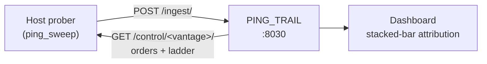

<p align="center">
  
</p>

<h1 align="center">PING_TRAIL</h1>

<p align="center">
  <strong>Our internet feels slow — which segment is injecting the latency?</strong>
  <br>
  Parallel hop-ladder ping with stacked-bar latency attribution.
  <br>
  Django + HTMX + Bootstrap 5.3 + ECharts
</p>

---

## What is PING_TRAIL?

Every ping tool tells you the round trip to *one* place. PING_TRAIL fires ICMP echo at **every rung of a ladder at once** — loopback, your router, the DSL box, the first ISP device, your resolver, the open internet, a distant anchor — and subtracts.

Simultaneity is the whole premise. Every rung experiences the same network conditions in that instant, so the RTT difference between adjacent rungs is attributable to the segment between them:

```
segment[i] = rtt[rung i] - rtt[rung i-1]
```

Stack the segments and the bar's total height equals the RTT to the deepest rung. **The band that swells is the answer.**

Probing rungs one after another compares different moments and makes the subtraction meaningless — which is why nothing here is sequential.



### The ladder

| Depth | Kind | What it measures |
|-------|------|------------------|
| 0 | `loopback` | Host scheduling noise floor |
| 1 | `gateway` | LAN + default-gateway responsiveness |
| 2 | `home_router` | Another router **inside the house** (private address) |
| 3 | `isp_hop` | Last mile / ISP backhaul — the first **public** address |
| 4 | `isp_dns` | ISP resolver infrastructure |
| 5 | `public_dns` | Open-internet edge (1.1.1.1, 8.8.8.8) |
| 6 | `anchor` | Long-haul transit |

A private address (RFC1918 or CGNAT) is **never** an ISP hop — address space decides, not traceroute position. That distinction is the difference between "your ISP is slow" and "your own second router is slow", and the tool refuses to guess wrong about it.

### Design commitments

- **Stacked bars, never lines.** A line interpolates latency across the gap between samples, inventing measurements that were never taken. One bar per discrete tick; a fully-timed-out tick is a gap, not a bridge.
- **Negative deltas are kept.** A router punts ICMP addressed *to* its own control plane onto a slow path while forwarding ICMP *through* it on the fast path, so a deeper rung can legitimately answer faster. Clamping that to zero would hide a real signal.
- **Loss is first-class.** A rung at 100% loss whose downstream neighbour still answers is the strongest diagnostic this tool produces: that box is deprioritizing ICMP, not dropping traffic.
- **Measurement is decoupled from presentation.** The web app never pings. A host-side **Vantage** owns the ICMP — because inside Docker the default gateway is the bridge, and on macOS the Docker "host" is a Linux VM behind its own NAT.

## Stack

| Layer | Tech |
|-------|------|
| Backend | Django 6.x (Python 3.14) |
| Interactivity | HTMX (CDN) |
| Styling | Bootstrap 5.3 (CDN) + Font Awesome 6 (CDN) |
| Charting | ECharts (vendored static) |
| Database | SQLite (WAL) |
| Dev environment | Docker Compose |

## Quickstart

### 1. The site (Docker)

```bash
docker compose up -d
```

Open <http://127.0.0.1:8030/> — migrations run automatically on start.

PING_TRAIL also rides the ABOUT_CLODE engineering harness as a TARGET_APP, where it boots from that compose root instead (`docker compose -f ../ABOUT/docker-compose.yml up -d ping-trail`). Both paths build the **same container name on the same port**, so run one or the other, never both.

### 2. The prober (host, not Docker)

```bash
/opt/homebrew/bin/python3.14 -m venv .venv
.venv/bin/pip install -r requirements.txt

.venv/bin/python app/manage.py discover_trail --trail home            # build the ladder
.venv/bin/python app/manage.py ping_sweep --vantage home-mac --loop   # start the daemon
```

ICMP needs no extra package and no root: unprivileged datagram sockets (`SOCK_DGRAM` / `IPPROTO_ICMP`) are stdlib.

**Sweeping ships disabled.** The daemon polls immediately, but fires nothing until you switch sweeping on from the dashboard — control is pull-only, so the site publishes orders and the prober obeys them within one interval. Stopping the *daemon* stays a host-side act; the badge distinguishes the two:

| Badge | Meaning |
|-------|---------|
| **ALIVE** | Polling and sweeping |
| **STOPPED** | Polling, sweeping switched off from the UI |
| **STALE** | Nothing has checked in for 2+ intervals — the host process is gone |

### 3. Verify

```bash
docker exec about-ping-trail-1 python manage.py trail_report --trail home --limit 10
docker exec about-ping-trail-1 python manage.py test trail
```

`trail_report` is the deterministic verifier — the per-tick table of raw RTTs, computed deltas, inversions, and loss. It is the proof the maths is right, and it runs before any browser check.

## Configuration

| Env var | Default | Purpose |
|---------|---------|---------|
| `DJANGO_DEBUG` | `1` | `1` = development. Set to `0` for anything reachable off-box — see below. |
| `DJANGO_SIGNING_KEY` | `dev-only-change-me` | Django signing key: sessions, CSRF, cookies. `DJANGO_SECRET_KEY` is accepted as an alias. |
| `PING_TRAIL_INGEST_TOKEN` | `dev-ingest-token` | Shared secret, sent as `X-Ping-Trail-Token` on `/ingest/` and `/control/`. |
| `DJANGO_DB_PATH` | `app/db.sqlite3` | SQLite location (container: `/data/db.sqlite3`). **The prober does not use it** — it talks HTTP only. |
| `PING_TRAIL_VANTAGE` | `home-mac` | Default vantage slug for the host commands |
| `PING_TRAIL_CMD` | `gunicorn --reload …` | Dev server command; prod uses the image `CMD` |
| `KEY_PREFIX` | `ping_trail` | Redis namespace within the fleet |

### The two secrets fail closed

Both dev defaults are printed above and live in `app/config/settings.py`, so
everyone reading this repo knows them. Each is a working attack once `DEBUG` is
off: the signing key forges sessions and CSRF tokens, and the ingest token is
the **only** authentication on `POST /ingest/` and `GET /control/<vantage>/`.

So with `DJANGO_DEBUG=0`, a dev default is refused at import — the process
raises `ImproperlyConfigured` and never serves a request:

```bash
DJANGO_DEBUG=0 \
DJANGO_SIGNING_KEY="$(python -c 'import secrets; print(secrets.token_urlsafe(50))')" \
PING_TRAIL_INGEST_TOKEN="$(python -c 'import secrets; print(secrets.token_urlsafe(32))')" \
  <your run command>
```

With `DJANGO_DEBUG=1` (the default) both defaults keep working, so a fresh
clone runs with no setup at all.

## Documentation

| File | Purpose |
|------|---------|
| [CLAUDE.md](CLAUDE.md) | Project overview, harness membership, data model, critical rules |
| [AGENTS.md](AGENTS.md) | Agent quick-start: constraints, conventions, verification |
| `LORE/` | Specs and todos, YAML-canonical (app_scope `ping_trail`) |

## License

[MIT](LICENSE). ECharts is vendored under the Apache License 2.0 — see
[`app/assets/js/echarts.LICENSE.txt`](app/assets/js/echarts.LICENSE.txt).
